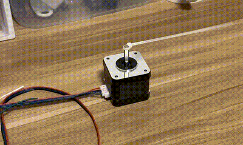
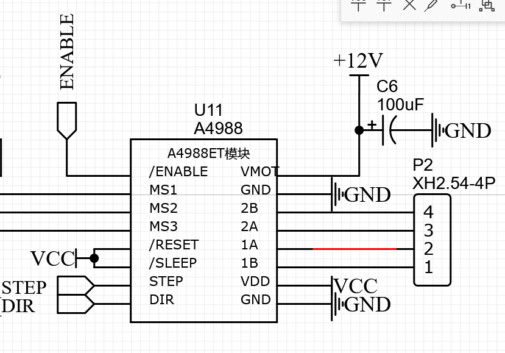
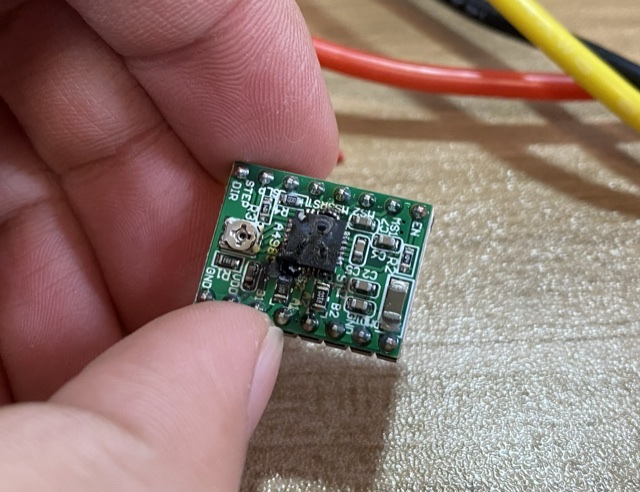

#### Where are we?

This example shows how I use `ESP32` to drive step motor through `A4988`. It works for me.



```cpp
#include "Stepmotor.h"

extern "C" void app_main(void)
{
    // 1.Create a motor instance
	Stepmotor motorX(0, 15, 2); // id(0~6), dirPin, stepPin
    
    while(1) {
        // 2.Update motor status
        motorX.isReady = Stepmotor::status[motorX.id];
        
        // 3.Ask the motor move a little
        if(motorX.isReady){
            ESP_LOGI(TAG, "motorX start moving");
            motorX.move(1000, 1000); // stepNum, speed(step/s)
        }
      
        vTaskDelay(20 / portTICK_RATE_MS);
    }
}
```


#### How does this works?

`ESP32` --> `A4988` --> `Stepmotor`

`A4988` is a step motor drive. Every time it receive a pulse, it will demand the step motor move a step. Normal step motor takes 200 full steps to complete an revolution, that means 200 pulses need be pass into `A4988`. In this example, I use the [MCPWM](https://docs.espressif.com/projects/esp-idf/en/latest/esp32/api-reference/peripherals/mcpwm.html) module of `ESP32` to generate pulse and the [PCNT](https://docs.espressif.com/projects/esp-idf/en/latest/esp32/api-reference/peripherals/pcnt.html) module to monitor how many pulses have been generated, once pulses number reach a threshold number (for example: 200), `PCNT` will trigger an interrupt, and change the status of motor as ready in interrupt service function.

The Schematic looks like this:



1. VMOT

   8v~35v DC, 100uF capacity is required.

2. 1A 1B

   first coil

3. 2A 2B

   second coil

4. VDD

   MCU power

5. DIR

   MCU output, high and low levels respectively represent one direction of rotation

6. STEP

   Each time receive a pulse, make step motor move one step.

7. MS1 MS2 MS3

   Divide a step into many micro steps, up to 16 divide. For example, 

   if we use  1 divide, the we need  200 pulse to make step motor rotate one revolution. 

   If we use 16 divide, the we need 3200 pulse to make step motor rotate one revolution. 

   

8. ENABLE

   High: start working

   Low:  stop working

9. SLEEP

   High: holding torque even when motor is not rotating.

   Low:  You can twist the motor by hand and turn it freely

10. RESET

    Floating by default. When set low, A4988 is reset. If you don't want control it, it should be connected to the SLEEP pin to set it high.


#### A4988 burning event



Reason: Connect MS1, MS2, MS3 to 24v